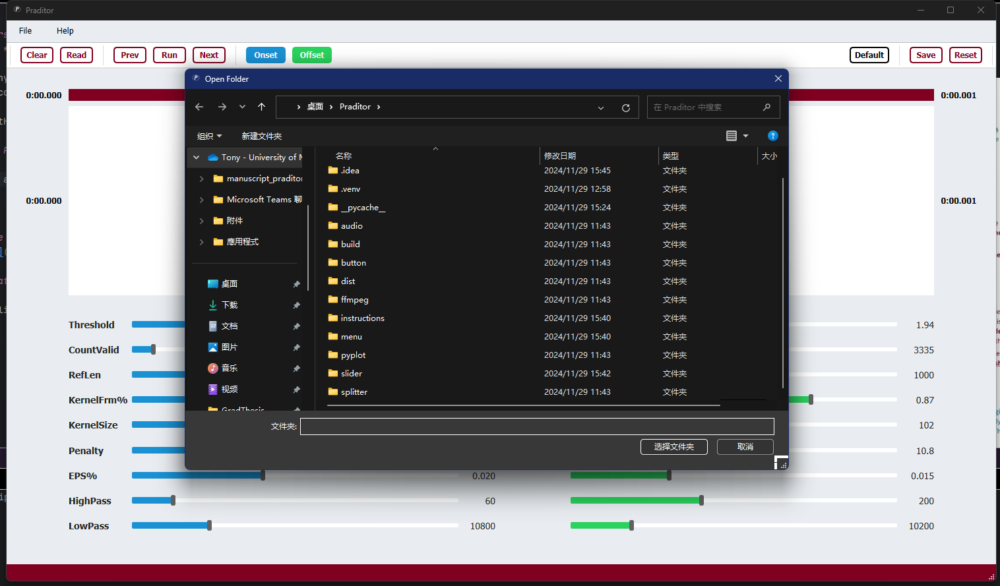
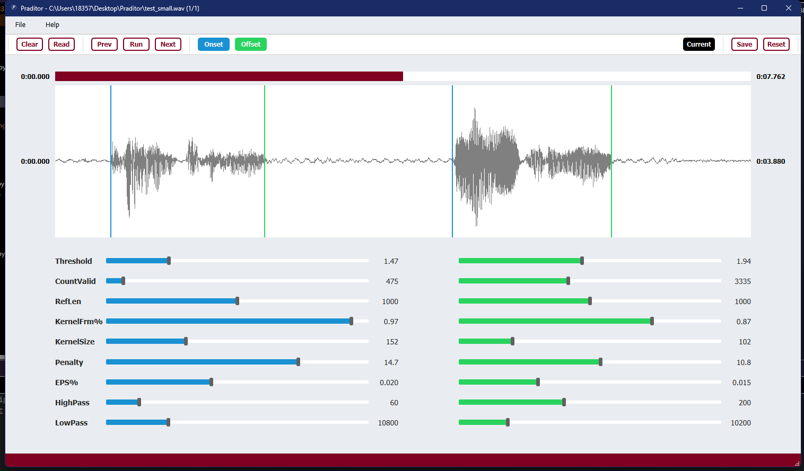
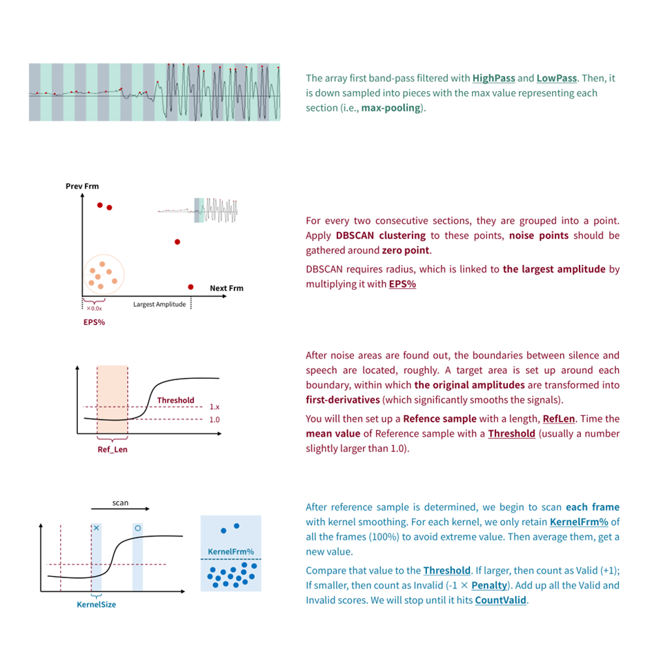

<h3 align="center">Praditor</h3>

A DBSCAN-Based Automation for Speech Onset Detection

## From Authors
Praditor is a **speech onset detector** that automatically detects all the possible boundaries between silence and sound sections.

If you have any questions in terms of how to use Praditor or its algorithm details,
feel free to contact me at `zhengyuan.liu@connect.um.edu.mo` or `paradeluxe3726@gmail.com`.

I'm new to GitHub and still learning how to use it. Please forgive me if there is something I missed. Thx XD

## How to use Praditor?

### 1. Import your audio

`File` -> `Read files...` -> Select **the folder path** where you store all the audios

### 2. Play with Praditor

- `Run` Apply Praditor Algorithm on the current Audio
- `Prev` & `Next` Go to previous/next Audio
- `Read` Read time points from current Audio's .TextGrid results
- `Clear` Clear time points that are being displayed
- `Onset` & `Offset` Show/Hide Onsets/Offsets
- `Current/Default` Display default parameters or parameters for the current file
- `Save` Save the displayed parameters as Current/Default
- `Reset` Reset the displayed parameters to the last time you saved it.

On the menu...
- `File` > `Read files...` > Select a folder path
- `Help` > `Parameters` > Show instructions on how our parameters work

## How to tune your parameters?

## Data and Materials

If you would like to download the datasets that were used in developing Praditor, please refer to [our OSF storage](https://osf.io/9se8r/)
.

