

<h3>
     
     
</h3>

<h3 align="center">

  <a href="https://github.com/Paradeluxe/Praditor">
    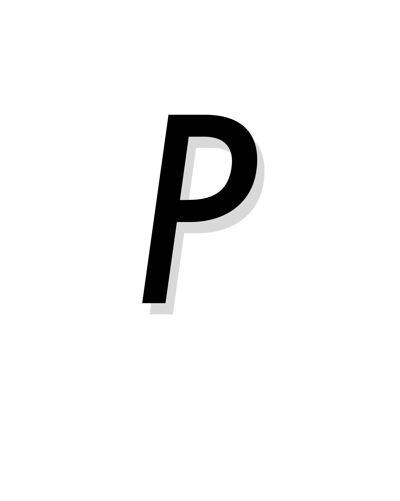
  </a>

Praditor

</h3>

A DBSCAN-Based Automation for Speech Onset Detection

  

    <a href="https://github.com/Paradeluxe/Praditor/releases"><strong>Download Praditor</strong></a>
     | 
    <a href="https://github.com/Paradeluxe/Praditor/blob/master/README.md"><strong>English</strong></a>
     · 
    <a href="https://github.com/Paradeluxe/Praditor/blob/master/README_zh.md"><strong>中文</strong></a>

  

 

# Features
Praditor is a **speech onset detector** that helps you find out boundaries between silence and sound **automatically**.

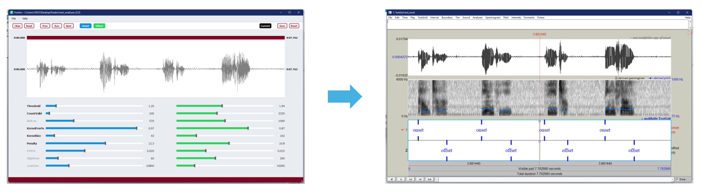

Praditor works for both **single-onset** and **multi-onset** audio files **without any language limitation**. 
It generates output as PointTiers in .TextGrid format. 

 - Onset/Offset Detection
 - Silence Detection

Praditor also allows users to adjust parameters in the Dashboard to get a better performance.

> You can try [test_audio.wav](https://github.com/Paradeluxe/Praditor/raw/master/test_audio/test_audio.wav) and 
> [mp3_test_audio.mp3](https://github.com/Paradeluxe/Praditor/raw/master/test_audio/mp3_test_audio.mp3)
> on _**Praditor**_.

# Video instruction (bilibili)
[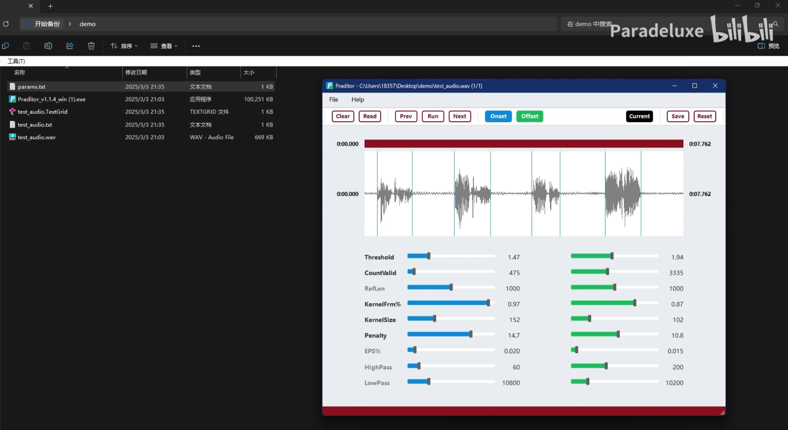](https://www.bilibili.com/video/BV1i3QPYkEzP/?share_source=copy_web&vd_source=04f6059f57092624c36ac4e9fc1efe10)

# Contact us
_Praditor_ is written and maintained by **Tony, Liu Zhengyuan** from Centre for Cognitive and Brain Sciences, University of Macau.

If you have any questions in terms of how to use _Praditor_ or its algorithm details, or you want me to help you write some additional
scripts like **export audio files**, **export Excel tables**,
feel free to contact me at `zhengyuan.liu@connect.um.edu.mo` or `paradeluxe3726@gmail.com`.

## 🙌 Acknowledgments
This project thrives thanks to these remarkable contributors:
- Thank **Yu Xinqi**, **Dr. Ma Yunxiao**, **Zhang Sifan** for their work in validating the effectiveness of _Praditor_'s algorithm.
- Thank **Hu Wing Chung** for her work in packaging _Praditor_ for macOS (arm64 and universal2)
- Thank **Prof. Zhang Haoyun** (University of Macau) and **Prof. Wang Ruiming** (South China Normal University) for their guidance and support for this project

# How to use _Praditor_?

Although I have prepared various buttons in this GUI, you do not have to use them all.

The simplest and easiest procedure is (1) import audio files, (2) hit the `extract` button,
(3) [optional] you are not happy about the results, fine-tune the parameters and hit the `extract` button again. 
**Until you are happy about the results, repeat step (2) and (3).**

## General

### import audio file(s)

`File` -> `Read files...` -> Select your target audio file

_Note_. All the other audio files will also be added to the list.

### play and stop

Press <kbd>F5</kbd> to play the audio signal that is currently presented in the window. 

Press <kbd>any key</kbd> to stop playing.

### run algorithm and extract onsets

Hit `Extract`. Wait for a while until the results come out. Onsets are in blue, offsets are in green.

### go to the next/previous audio file

Hit `Next`/`Prev`.

## .TextGrid related

### I wanna temporarily clear the annotations

Hit `Clear`. This does not delete/change the .TextGrid file. It's safe.

### Oh no, I want the cleared annotations back

Hit `Read`. _Praditor_ will go back to the .TextGrid and present whatever is in it.

### Hide/Show annotations

Press `Onset`/`Offset` (sometimes they are the number of Onsets/Offsets). 

## Parameters

`Current/Default` Display default parameters or parameters for the current file

`Save` Save the displayed parameters as Current/Default

`Reset` Reset the displayed parameters to the last time you saved it.

## Audio signal

### Mouse & Keyboard
<kbd>Wheel ↑</kbd>/<kbd>Wheel ↓</kbd> to zoom-in/out at **amplitude**

<kbd>Ctrl/Command</kbd>+<kbd>Wheel ↑</kbd>/<kbd>Wheel ↓</kbd> to zoom-in/out at **timeline**

<kbd>Shift</kbd>+<kbd>Wheel ↓</kbd>/<kbd>Wheel ↑</kbd> to move forward/backward in **timeline** 

### Touchpad
<kbd>↑✌↑</kbd>/<kbd>↓✌↓</kbd> to zoom-in/out at **amplitude**

<kbd>←✌→</kbd>/<kbd>→✌←</kbd> to zoom-in/out at **timeline**

<kbd>←←✌</kbd>/<kbd>✌→→</kbd> to move forward/backward in **timeline** 

# How does _Praditor_ work?
The audio signal is first band-pass filtered to remove some high/low frequency noise. 
Then, it is down sampled with max-pooling strategy (i.e., using the max value to represent each piece).

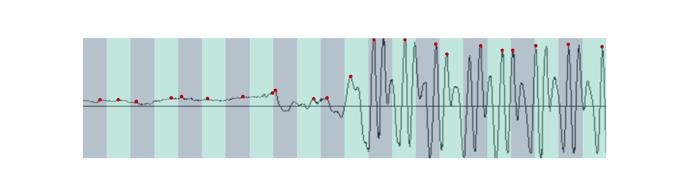

DBSCAN requires two dimensions. How do we transform 1-D audio signal into 2-D array?
For every two consecutive pieces, they are grouped into a **point**. The point has two dimensions, previous and next frame.
On this point array, Praditor applies DBSCAN clustering to these points. 
Noise points are usually gathered around (0, 0) due to their relatively small amplitudes.

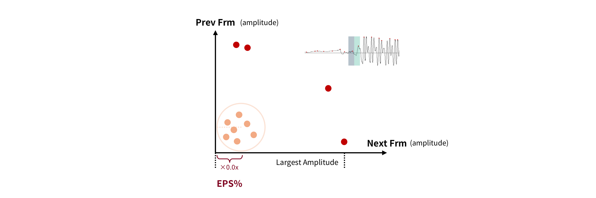

At this point, noise areas are found, which means we have roughly pinpoint the probable locations of onsets (i.e., target area).

We do not continue to use the original amplitudes, but first derivatives. First-derivative thresholding is a common technique
in other signal processing areas (e.g., ECG). It keeps the trend but remove the noisy ("spiky") part, which helps to improve the performance.

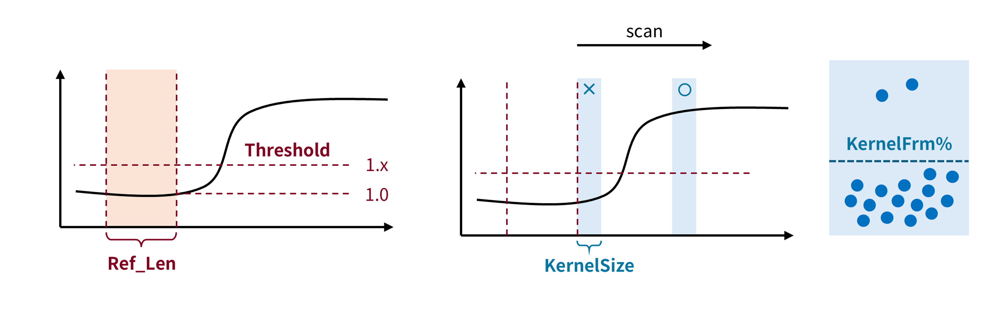

For every target area, we do the same procedure as below:
1. Set up a noise reference. It's **mean absolute first-derivatives** as baseline.
2. Set up a **starting frame** as the onset candidate (start from the very next frame from the noise reference).
3. Scan from the starting frame. We use **kernel smoothing** to see if the current frame (or actually kernel/window) is **valid/invalid**.
4. When we gather enough **valid** frames, the exact frame/time point we stop is the answer we want. Otherwise, we move on to the next starting frame.

# Parameters
## HighPass/LowPass
Before we apply down sampling and clustering to the audio signal, a band pass filter is first applied to the original signal.
The idea is that we do not need all the frequencies. Too high and too low frequency band can be contaminated. 

What we need is the middle part that has high contrast between silence and sound.

Be reminded that the **_LowPass_** should not surpass the highest valid frequency (half of the sample rate, refer to _Nyquist theorem_).

## EPS%

DBSCAN clustering requires two parameters: **EPS** and **MinPt**. What DBSCAN does is to scan every point, take it as the circle center, 
and draw a circle with a radius **EPS** in length. Within that circle, calculate how many points within and count them valid if hit **MinPt**.

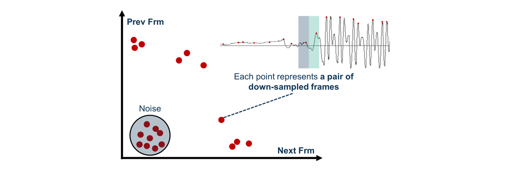

Praditor allows user to adjust **_EPS%_**. Since every audio file can have different amplitude level/silence-sound contrast,
Praditor determines **EPS = Current Audio's Largest Amplitude * _EPS%_**.

## RefLen
After Praditor has confirmed target areas, the original amplitudes is the transformed into absolute first-derivatives. 
For each target area, Praditor would set up a _Reference Area_, whose mean value serves as the baseline for later thresholding.

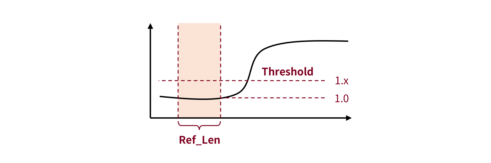

The length of this reference area is determined by _**RefLen**_. 
When you want to capture silence that has very short length, it is better that you turn down _**RefLen**_ a little bit as well.

## Threshold
It is the most used parameter. The core idea of thresholding method is about "Hitting the cliff".
Whenever a talker speaks, the (absolute) amplitude rises up and creates a "cliff" (in amplitude, or other features).

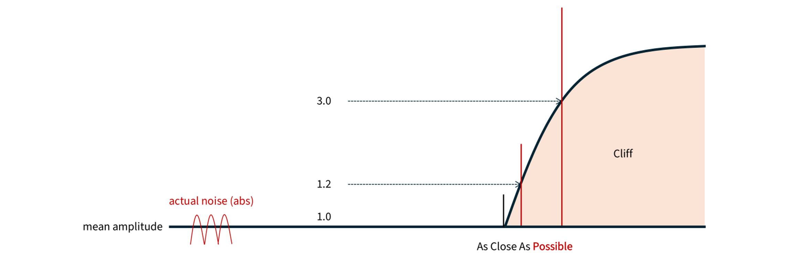

**_Threshold_** has a minimum limitation at **1.00**, which is based on the mean value of background-noise reference.
However, background noise is not "smoothy" but actually "spiky". 
That is why **_Threshold_** is usually **slightly larger than 1.00**.

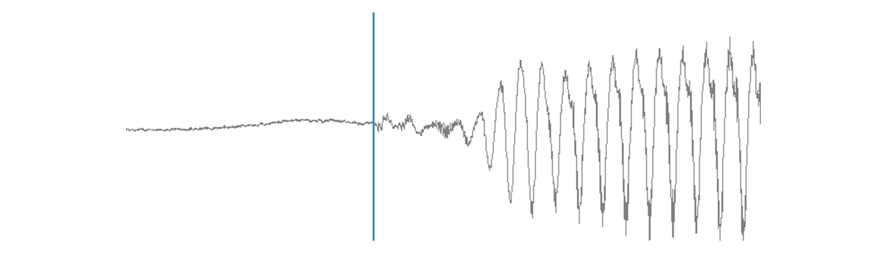

Besides, I would suggest you pay more attention to **aspirated sound**, as this type of sound has "very slow slope". 
Too large **_Threshold_** can end up in the middle of that "slope" (which is something you don't want). 
If that's the case, it can sound really weird, like a burst, rather than gradually smooth in.

## KernelSize, KernelFrm%
After reference area and threshold are set, Praditor will (1) set up a starting frame (2) begin scan frame by frame (starting from the frame right next to ref area). 
It will repeat this process until the valid starting frame (i.e., onset) is found.

Usually we would compare the value (absolute 1st derivative) with threshold. If it surpasses, we call it **valid**; if not, then **invalid**.
But, Praditor does it a little bit differently, using **kernel smoothing**.
Praditor would borrow information from later frames, like setting up a window (kernel) with a length, **_KernelSize_**.

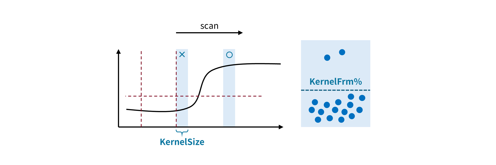

To prevent extreme values, Praditor would neglect the first few largest values in the window (kernel). Or, we only retain 
**_KernelFrm%_** of all frames (e.g., 80% of all).
If there is actually extreme values, then we successfully avoid them; if not, then it would not hurt since they are
among other values at similar level.

## CountValid, Penalty
**How do we say an onset is an onset?** After that onset, lots of frames are **above threshold consecutively**.

Just as mentioned above, as Praditor scans frame by frame (window by window, or kernel by kernel), each frame is either going to be **above** or **below** the threshold. 
If the current frame (kernel) surpass the threshold, then it's **valid** and  counted as **+1**; 
If it fails to surpass, then it's **invalid** and counted as **-1 * _Penalty_**. 

Then, Praditor adds them up to get a **sum**. 
Whenever the **sum** hits zero or below zero, the scanning aborts, and we move on to the next starting frame.
On other words, we only want a starting frame whose **scanning sum stays positive**. 

**_Penalty_** here is like a "knob" for tuning **noise sensitivity**. **Higher** **_Penalty_** means higher sensitivity to **below-threshold frames.**

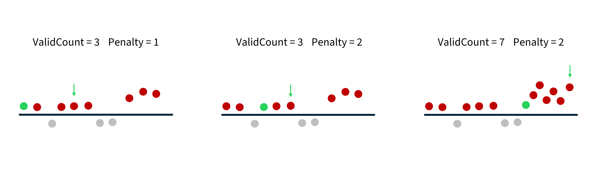

In summary, each scan has a starting frame (i.e., onset candidate). What we do is to check if this "starting frame" is "valid". 
By saying it "valid", we are saying that scanning sum stays positive and hits **_CountValid_** in the end.

Then, we can say, this is the exact **time point (onset/offset)** we want.

# Data and Materials

If you would like to download the datasets that were used in developing Praditor, please refer to [our OSF storage](https://osf.io/9se8r/)
.

