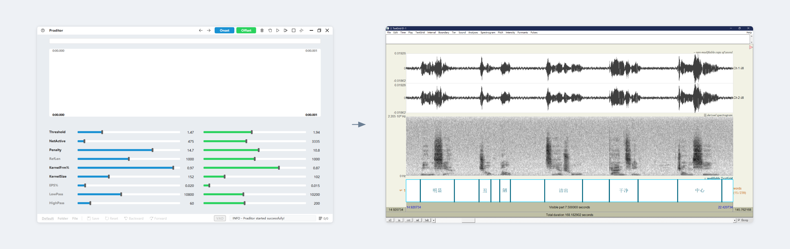

[](./LICENSE)


[](https://doi.org/10.3758/s13428-025-02776-2)


<h3>
    <br/>
    <br/>
</h3>


<h3 align="center">


<p align="center">
  <a href="https://github.com/Paradeluxe/Praditor">
    
  </a>
</p>

<p align="center">
Praditor
</p>
</h3>

<p align="center">
A DBSCAN-Based Automation for Speech Onset Detection and Voice Activity Detection
</p>


  <p align="center">
    <a href="https://github.com/Paradeluxe/Praditor/releases"><strong>Download Praditor</strong></a>
     | 
    <a href="https://github.com/Paradeluxe/Praditor/blob/master/README.md"><strong>English</strong></a>
     · 
    <a href="https://github.com/Paradeluxe/Praditor/blob/master/README_zh.md"><strong>中文</strong></a>
     | 
    <a href="https://doi.org/10.3758/s13428-025-02776-2"><strong>Our Paper</strong></a>
  </p>

<br/>

# Features

Praditor is a **speech onset detector** that automatically finds boundaries between silence and sound. It supports two detection modes and generates output in `.TextGrid` format — ready for use in Praat.

> [!TIP]
> Need **automatic** time & content annotation? Check out **[Praasper](https://github.com/Paradeluxe/Praasper)** — **a VAD-Enhanced Automatic Speech Annotation pipeline for Psycholinguistic Research**.

- **Onset/Offset Detection** (Default Mode) — Detects the start and end of sound events using DBSCAN clustering and first-derivative thresholding. Outputs `PointTier` layers for onsets (blue) and offsets (green).
- **Voice Activity Detection** (VAD Mode) — Detects speech segments and outputs an `IntervalTier` with "sound" intervals. VAD mode uses fixed kernel parameters and processes audio in 15-second segments with intelligent boundary detection.
- **Batch Processing** — `Run All` processes every audio file in the current folder, generating `.TextGrid` and CSV summary files.
- **Parameter Persistence** — Three save modes (Default / Folder / File) with priority-based loading. VAD mode parameters are stored separately with `_vad` suffix.
- **Parameter History** — Navigate through up to 10 previous parameter sets with `Backward` / `Forward` buttons.
- **CSV Export** — Automatic per-folder CSV summary with timestamps for all processed audio files.
- **Real-time Preview** — `Test` button estimates onset/offset count without modifying `.TextGrid` output.

> Try [test_audio.wav](https://github.com/Paradeluxe/Praditor/raw/master/resources/test_audio/test_audio.wav) and [test_audio_mp3.mp3](https://github.com/Paradeluxe/Praditor/raw/master/resources/test_audio/test_audio_mp3.mp3) on **Praditor**.
> `test_audio_mp3.mp3` is from [an online resource](https://accent.gmu.edu/browse_language.php?function=detail&speakerid=462), while `test_audio.wav` and `test_large_audio.wav` are from our own experiments.


# GUI Overview



## Titlebar

| Button | Action |
|--------|--------|
| `File` | Import audio files (`.mp3`, `.wav`, `.ogg`, `.aac`, `.flac`, `.amr`, `.wma`, `.aiff`) |
| `?` (Help) | Open documentation |
| `Run` | Run detection on the current file |
| `Run All` | Batch process all audio files in the current folder |
| `Test` | Preview how many onsets/offsets would be detected with current parameters (does not modify `.TextGrid`) |
| `Stop` | Cancel running detection |
| `Trash` | Clear displayed annotations (does not modify `.TextGrid`) |
| `Read` | Reload annotations from `.TextGrid` file |
| `Onset` | Toggle onset annotations (blue) |
| `Offset` | Toggle offset annotations (green) |
| `◀` / `▶` | Navigate to previous / next audio file |

## Audio Viewer

Displays waveform with onset/offset markers and time labels. Supports zoom and scroll via mouse, keyboard, and touchpad.

### Mouse & Keyboard
- `Wheel ↑` / `Wheel ↓` — Zoom amplitude
- `Ctrl` + `Wheel ↑` / `Wheel ↓` — Zoom timeline
- `Shift` + `Wheel ↓` / `Wheel ↑` — Scroll timeline
- `F5` — Play / pause audio; any key to stop

### Touchpad
- Vertical scroll — Zoom amplitude
- Horizontal scroll — Zoom timeline
- Horizontal swipe — Scroll timeline

> **Timeline zoom** may not work on macOS touchpad. Use `Command + I` / `Command + O` instead.

## Parameter Sliders

Nine parameters for onset (blue) and nine for offset (green), independently adjustable:

| Parameter | Description |
|-----------|-------------|
| `Threshold` | Coefficient for actual threshold (baseline × coefficient) |
| `NetActive` | Accumulated net count of above-threshold frames required |
| `Penalty` | Penalty for below-threshold frames |
| `RefLen` | Length of reference segment for baseline calculation |
| `KernelFrm%` | Percentage of frames retained in the kernel |
| `KernelSize` | Kernel size in frames |
| `EPS%` | Neighborhood radius in DBSCAN clustering |
| `LowPass` | Lower cutoff frequency of bandpass filter |
| `HighPass` | Higher cutoff frequency of bandpass filter |

In VAD mode, offset sliders are hidden and `Penalty`, `RefLen`, `KernelFrm%`, `KernelSize` are fixed to VAD-optimized defaults.

## Toolbar

| Button | Action |
|--------|--------|
| `Default` | Use application-level default parameters |
| `Folder` | Use folder-level parameters (`params.txt` / `params_vad.txt` in current folder) |
| `File` | Use file-specific parameters (same name as audio file, `.txt` extension) |
| `Save` | Save current parameters to selected mode(s) |
| `Reset` | Reload parameters from selected mode's saved file |
| `Backward` / `Forward` | Navigate parameter history (up to 10 sets per mode) |
| `VAD` | Toggle VAD mode |
| `1/10` | Current parameter index / total |

**Priority**: File > Folder > Default. When multiple modes are selected, `Save` writes to all selected locations; `Reset` loads from the highest-priority location that exists.


# Video Instruction

<div align="center">

<div style="display: flex; justify-content: space-between; align-items: center;">
  <a href="https://www.bilibili.com/video/BV1UnKWzmEBz/"></a>
  <a href="https://youtu.be/68bqwj3q-Ag?si=yAwNLceIqdiQuNFE"></a>
</div>

</div>


# Fine-tuning Guidance

> Basic understanding is enough. Understanding the algorithm is better.

- **Basic knowledge**: Go to the first section of [**Quick Fix**](markdown/quick_fix.md).
- **Advanced knowledge**: Go to the second section of [**Quick Fix** (Detailed Introduction)](markdown/quick_fix.md#detailed-introduction).
- **Expert knowledge**: Go to [**Parameters**](./markdown/params.md).


# Data and Materials

If you would like to download the datasets that were used in developing **Praditor**, please refer to [our OSF storage](https://osf.io/9se8r/).


# Citation

If you use **Praditor** in your research, please cite the following paper:

```
Liu, Z., Yu, X., Hu, W.C. et al. Praditor: A DBSCAN-based automation for speech onset detection. Behav Res 57, 247 (2025). https://doi.org/10.3758/s13428-025-02776-2
```

Or download `.ris` from the paper's [**About this article**](https://link.springer.com/article/10.3758/s13428-025-02776-2#article-info) page.


# Acknowledgments

Shout out to these remarkable contributors!

- Thank **YU Xinqi**, **Dr. MA Yunxiao**, **ZHANG Sifan** for their work in validating the effectiveness of **Praditor**'s algorithm.
- Thank **HU Wing Chung** for her work in packaging **Praditor** for macOS (arm64 and universal2).
- Thank **Prof. ZHANG Haoyun** (University of Macau) and **Prof. WANG Ruiming** (South China Normal University) for their guidance and support.

Also, the funding:

- This project was funded by the National Natural Science Foundation of China (32200845), the Science and Technology Development Fund, Macao S.A.R (FDCT, 0153/2022/A), and the Multi-Year Research Grant (MYRG2022-00148-ICI) from the University of Macau to Haoyun Zhang.


# Contact

**Praditor** is written and maintained by **Tony, Liu Zhengyuan** from the Centre for Cognitive and Brain Sciences, University of Macau.

If you have questions about using **Praditor**, its algorithm details, or need custom scripts (audio export, Excel tables, etc.), feel free to contact me at `zhengyuan.liu@connect.um.edu.mo` or `paradeluxe3726@gmail.com`.


## License

Praditor is **dual-licensed** under AGPL v3 + a commercial license ([LICENSE](./LICENSE)):

- **AGPL v3** (default): free, open source. Academic / personal / non-profit /
  small orgs can use it directly. Only requirement: if you offer Praditor as a
  network service, you must make the source available.
- **Commercial License**: if you cannot accept AGPL copyleft obligations (e.g.
  commercial products, SaaS, large org internal use), purchase a commercial
  license to waive AGPL terms.

See [COMMERCIAL-LICENSE.md](./COMMERCIAL-LICENSE.md) for details.
