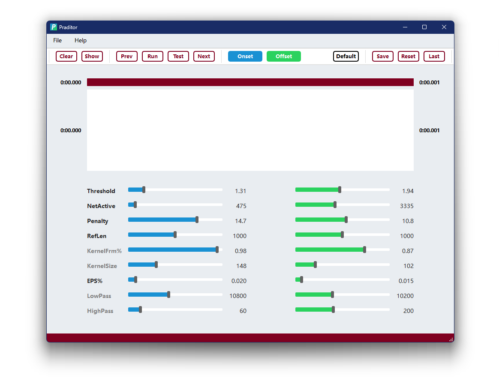

 
 

  

<h3 align="center">Praditor</h3>

A DBSCAN-Based Automation for Speech Onset Detection

  

    <a href="https://github.com/Paradeluxe/Praditor/releases"><strong>Download Praditor</strong></a>
     

  

# Features
Praditor is a **speech onset detector** that helps you find out all the possible boundaries between silence and sound sections **automatically**.

Praditor works for both **single-onset** and **multi-onset** audio files **without any language limitation**. 
It generates output as PointTiers in .TextGrid format. 

 - Onset/Offset Detection
 - Silence Detection

To get a better performance, Praditor can also allow users to adjust parameters in the Dashboard.

# From Authors
If you have any questions in terms of how to use Praditor or its algorithm details,
feel free to contact me at `zhengyuan.liu@connect.um.edu.mo` or `paradeluxe3726@gmail.com`.

I'm new to GitHub and still learning how to use it. Please forgive me if there is something I missed. Thx XD

# How to use Praditor?

## 1. Import your audio

`File` -> `Read files...` -> Select your target audio file

## 2. Play with Praditor

**For onset/offset...**
- `Run` Apply Praditor algorithm on the current audio
- `Prev`/`Next` Go to previous/next audio
- `Read` Read time points from current audio's .TextGrid results
- `Clear` Clear time points that are being displayed (but no change to .TextGrid)
- `Onset`/`Offset` Show/Hide onsets/offsets

**For parameters...**
- `Current/Default` Display default parameters or parameters for the current file
- `Save` Save the displayed parameters as Current/Default
- `Reset` Reset the displayed parameters to the last time you saved it.

**On the menu...**
- `File` > `Read files...` > Select an audio file
- `Help` > `Parameters` > Show quick instruction on how our parameters work

**In case you want to zoom in/out**

 - <kbd>Wheel ↑</kbd>/<kbd>Wheel ↓</kbd> to zoom-in/zoom-out in **timeline**
 - <kbd>Ctrl</kbd>+<kbd>Wheel ↑</kbd>/<kbd>Wheel ↓</kbd> to zoom-in/zoom-out (for Windows users)
 - <kbd>Command</kbd>+<kbd>Wheel ↑</kbd>/<kbd>Wheel ↓</kbd> to zoom-in/zoom-out (for Mac users)

# How does Praditor work?

The audio signal is first band-pass filtered with _**HighPass**_ and _**LowPass**_. 
Then, it is down sampled with max-pooling strategy (i.e., using the max value to represent each piece).

DBSCAN requires two dimensions at least. How do we transform 1-D audio signal into 2-D array?
For every two consecutive pieces, they are grouped into a _point_. The point has two dimensions, previous and next frame.

On this point array, Praditor applies DBSCAN clustering to these points. 
Noise points are usually gathered around (0, 0) due to their relatively small amplitudes.

At this point, noise areas are found, which means we have roughly pinpoint the probable locations of onsets (i.e., target area).

We do not continue to use the original amplitudes, but first derivatives. First-derivative thresholding is a common technique
in other signal processing areas (e.g., ECG). It keeps the trend but remove the noisy ("spiky") part, which helps to improve the performance.

For every target area, we do the same procedure as below:
1. Set up a noise reference. It's **mean absolute first-derivatives** as baseline.
2. Start scanning from the very next frame. We use kernel smoothing to see if the current frame (or actually kernel/window) is **valid/invalid**.

# Parameters
## HighPass/LowPass
Before we apply down sampling and clustering to the audio signal, a band pass filter is first applied to the original signal.
The idea is that we do not need all the frequencies. Too high and too low frequency band can be contaminated. 

What we need is the middle part that has high contrast between silence and sound.

Be reminded that the **_LowPass_** should not surpass the highest valid frequency (half of the sample rate, refer to _Nyquist theorem_).

## EPS%

DBSCAN clustering requires two parameters: **EPS** and **MinPt**. What DBSCAN does is to scan every point, take it as the circle center, 
and draw a circle with a radius **EPS** in length. Within that circle, calculate how many points within and count them valid if hit **MinPt**.

Praditor allows user to adjust **_EPS%_**. Since every audio file can have different amplitude level/silence-sound contrast,
Praditor determines **EPS = Current Audio's Largest Amplitude * _EPS%_**.

## RefLen
After Praditor has confirmed target areas, the original amplitudes is the transformed into absolute first-derivatives. 
For each target area, Praditor would set up a _Reference Area_, whose mean value serves as the baseline for later thresholding.

The length of this reference area is determined by _**RefLen**_. 
When you want to capture silence that has very short length, it is better that you turn down _**RefLen**_ a little bit as well.

## Threshold
It is the most used parameter. The core idea of thresholding method is about "Hitting the cliff".
Whenever a talker speaks, the (absolute) amplitude rises up and creates a "cliff" (in amplitude, or other features).

**_Threshold_** has a minimum limitation at **1.00**, which is based on the mean value of background-noise reference.
However, background noise is not "smoothy" but actually "spiky". 
That is why **_Threshold_** is usually **slightly larger than 1.00**.

Besides, I would suggest you pay more attention to **aspirated sound**, as this type of sound has "very slow slope". 
Too large **_Threshold_** can end up in the middle of that "slope" (which is something you don't want). 
If that's the case, it can sound really weird, like a burst, rather than gradually smooth in.

## KernelSize, KernelFrm%
After reference area and threshold are set, Praditor will begin scan frame by frame (starting from the frame right next to ref area). 

Usually we would compare the value (abs 1st derivative) with threshold. If it surpasses, we call it _valid_; if not, then _invalid_.
But, Praditor does it a little bit differently, using **kernel smoothing**.
Praditor would borrow information from later frames, like setting up a window (kernel) with a length, **_KernelSize_**,

To prevent extreme values, Praditor would neglect the first few largest values in the window (kernel). 
If there is actually extreme values, then we successfully avoid them; If there is not, then it would not hurt since they are
among other values at similar level.

## CountValid, Penalty
As Praditor scans frame by frame (window by window, or kernel by kernel), it is either going to be **above** or **below** the threshold. 

If the current frame surpass the threshold, then it's counted as **+1**; 
If it fails to surpass, then it's counted as **-1 * _Penalty_**. 

Then, Praditor would add them up, until it hits your standard, **_CountValid_**. 
There you go, this is the exact **time point (onset/offset)** we want.

# Data and Materials

If you would like to download the datasets that were used in developing Praditor, please refer to [our OSF storage](https://osf.io/9se8r/)
.

