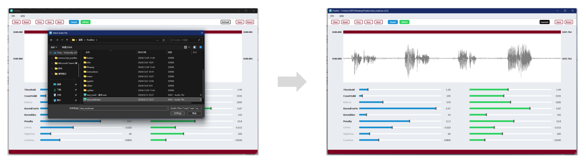

 
 

  

<h3 align="center">Praditor</h3>

A DBSCAN-Based Automation for Speech Onset Detection

  

    <a href="https://github.com/Paradeluxe/Praditor/releases"><strong>Download Praditor</strong></a>
     

  

## Features
Praditor is a **speech onset detector** that helps you find out all the possible boundaries between silence and sound sections **automatically**.

Praditor works for both single-onset and multi-onset audio files without any language limitation. 
It generates output as PointTiers in .TextGrid format. 

 - Onset/Offset Detection
 - Silence Detection

To get a better performance, Praditor can also allow users to adjust parameters in the Dashboard.

## From Authors
If you have any questions in terms of how to use Praditor or its algorithm details,
feel free to contact me at `zhengyuan.liu@connect.um.edu.mo` or `paradeluxe3726@gmail.com`.

I'm new to GitHub and still learning how to use it. Please forgive me if there is something I missed. Thx XD

## How to use Praditor?

### 1. Import your audio

`File` -> `Read files...` -> Select your target audio file

### 2. Play with Praditor

**For onset/offset...**
- `Run` Apply Praditor algorithm on the current audio
- `Prev`/`Next` Go to previous/next audio
- `Read` Read time points from current audio's .TextGrid results
- `Clear` Clear time points that are being displayed (but no change to .TextGrid)
- `Onset`/`Offset` Show/Hide onsets/offsets

**For parameters...**
- `Current/Default` Display default parameters or parameters for the current file
- `Save` Save the displayed parameters as Current/Default
- `Reset` Reset the displayed parameters to the last time you saved it.

**On the menu...**
- `File` > `Read files...` > Select an audio file
- `Help` > `Parameters` > Show quick instruction on how our parameters work

**In case you want to zoom in/out**

 - <kbd>Wheel ↑</kbd>/<kbd>Wheel ↓</kbd> to zoom-in/zoom-out in **timeline**
 - <kbd>Ctrl</kbd>+<kbd>Wheel ↑</kbd>/<kbd>Wheel ↓</kbd> to zoom-in/zoom-out (for Windows users)
 - <kbd>Command</kbd>+<kbd>Wheel ↑</kbd>/<kbd>Wheel ↓</kbd> to zoom-in/zoom-out (for Mac users)

### Parameters
#### HighPass/LowPass
Before we apply down sampling and clustering to the audio signal, a band pass filter is first applied to the original signal.
The idea is that we do not need all the frequencies. Too high and too low frequency band can be contaminated. 

What we need is the middle part that has high contrast between silence and sound.

#### Threshold
It is the most used parameter. The core idea of thresholding method is about "Hitting the cliff".
Whenever a talker speaks, the (absolute) amplitude rises up and creates a "cliff" (in amplitude, or other features).

**_Threshold_** has a minimum limitation at **1.00**, which is based on the mean amplitudes of background-noise reference.
However, background noise is not "smoothy" but actually "spiky". 
That is why **_Threshold_** is usually **slightly larger than 1.00**.

Besides, I would suggest you pay more attention to **aspirated sound**, as this type of sound has "very slow slope". 
Too large **_Threshold_** can end up in the middle of that "slope" (which is something you don't want).

If an audio starting with aspirated sound is cut halfway in the aspiration, it can sound really weird like a burst, rather than smooth in.

## How does Praditor's parameters work?

## Data and Materials

If you would like to download the datasets that were used in developing Praditor, please refer to [our OSF storage](https://osf.io/9se8r/)
.

