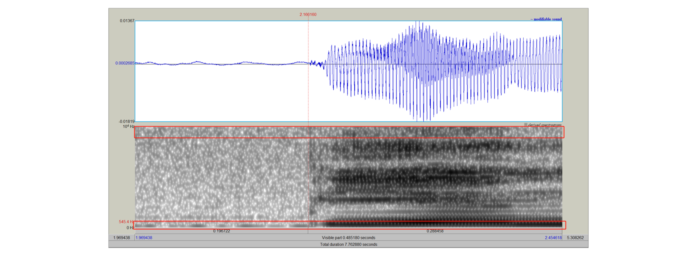
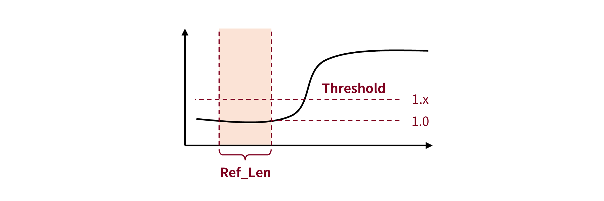
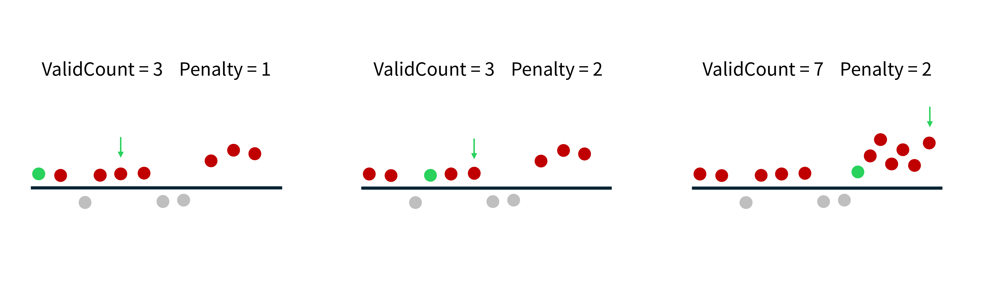

 
 

<h3 align="center">

  

Praditor

</h3>

基于DBSCAN聚类的自动语音起始点检测器

  

    <a href="https://github.com/Paradeluxe/Praditor/releases"><strong>下载 Praditor</strong></a>
     | 
    <a href="https://github.com/Paradeluxe/Praditor/blob/master/README.md"><strong>English</strong></a>
     · 
    <a href="https://github.com/Paradeluxe/Praditor/blob/master/README_zh.md"><strong>中文</strong></a>

  

 

# 特点
作为**语音起始检测器**， Praditor可以帮助你自动地找到所有的**有声**和**无声**的边界。

Praditor可以处理**单起始点**和**多起始点**音频文件，无论你的音频文件是什么语言。

 - 起始点/结束点检测
 - 有声/无声检测

Praditor计算得出的起始点会以.TextGrid的PointTier呈现，并允许用户调整参数以获得更好的结果。

# 来自作者

因为Praditor的给出的结果文件是PointTier，而PointTier通常不好操作。如果你需要一些**后续脚本**：

- 导出单个音频文件
- 导出时间戳为表格文件（e.g., .xlsx, .csv)
- 其他需求

或者单纯想知道如何使用Praditor，欢迎联系我的邮箱 `zhengyuan.liu@connect.um.edu.mo` 或 `paradeluxe3726@gmail.com`，
我们可以聊聊具体的合作事宜。

# 如何使用Praditor?

## 1. 导出音频

`File` -> `Read files...` -> 选择目标音频文件

## 2. 使用Praditor

**对于起始点/终止点...**
- `Run` 应用 Praditor 算法于当前音频
- `Prev`/`Next` 上一个/下一个音频
- `Read` 从当前音频的.TextGrid结果文件里读取时间戳
- `Clear` 清除已显示的时间戳
- `Onset`/`Offset` 显示/隐藏起始点/终止点

**对于参数...**
- `Current/Default` 显示默认/当前参数（即，独属于当前文件的参数）
- `Save` 把仪表盘显示的参数保存为默认/当前参数
- `Reset` 重置参数（清除显示的参数，并显示已保存的默认/当前参数）

**对于菜单...**
- `File` > `Read files...` > 选择音频文件
- `Help` > `Parameters` > 显示**如何调整参数**的快速指导

**如果你想要放大/缩小视图**

 - <kbd>滚轮 ↑</kbd>/<kbd>滚轮 ↓</kbd> 在**时间线**上放大/缩小
 - <kbd>Ctrl</kbd>+<kbd>滚轮 ↑</kbd>/<kbd>滚轮 ↓</kbd> 在**波幅**上放大/缩小 (针对 Windows 用户)
 - <kbd>Command</kbd>+<kbd>滚轮 ↑</kbd>/<kbd>滚轮 ↓</kbd> 在**波幅**上放大/缩小 (针对 Mac 用户)

# Praditor 的算法
音频信号首先经过**带通滤波**降噪，以滤除高频/低频的噪声。然后，音频信号会进行**最大池化 (max-pooling)降采样 (down sampling)**，
即用最大值来代表每一个区块。

DBSCAN需要数据集具有**两个维度**，而音频信号是一维的时许信号。我们应该如何把一维的音频信号转化为二维的数组？
我们试着把每两个连续的（降采样）区块组合成一个**点**，那么，这个**点**就具有了两个维度：前一帧、后一帧。

根据这样的转换逻辑，我们就得到了一个音频信号的二维点阵。
接着，Praditor 就将 DBSCAN 聚类算法应用于这个点阵，并成功地将靠近原点的噪声点聚集（因为噪声点的振幅通常较小）。

到了这个阶段，我们已经找到了所有的噪声区域，意味着可能存在起始点的**目标区域**已经大致定位到了（即，噪声区域的边缘）。

接着，我们将对信号求导，得到音频信号的一阶导。一阶导阈值法是一种常见的信号处理手段（例如，心电 ECG），可以用于平滑信号/降噪。
求导的操作使得信号的**趋势**得以保留，去除了毛糙的部分。这对阈值法的表现的提升十分重要。

对于每一个**目标区域**，我们重复以下之流程：
1. 设置一个噪声参考区域。该段信号的**一阶导的绝对值的均值**将作为基线。
2. 从参考区域的下一帧开始，逐一作为**开始帧（starting frame）**，也就是**起始点候选**。
3. 从开始帧开始，往后逐帧扫描。Praditor 使用**核平滑（kernel smoothing）** 的方法来检查当前帧（或者说，当前核/时间窗）是**有效的/无效的**。
4. 当我们得到了足够的**有效帧**，此时的开始帧/时间戳即我们想要的**起始点（onset）**。否则，我们进入到下一个**开始帧**的验证。

# 参数
## HighPass/LowPass
在开始对音频信号进行降采样+聚类之前，我们首先对于原始信号进行带通滤波。原因是，其实我们并不需要这么完整的频段，太高或者太低的频段可能被污染。

我们需要的其实就是中间这部分频段，**无声**和**有声**的**对比度最大**。

请注意，参数**_LowPass_**不可以超过该音频的最高有效频率，即采样率的一般（具体原理请参考**奈奎斯特定理**）。

## EPS%
DBSCAN 聚类需要两个参数：**EPS** 和 **MinPt**。
DBSCAN 的聚类逻辑是：检查每一个点，以该点为圆心，**EPS** 为半径画圆。如果这个圆里有足够多数量的点（即，达到**MinPt**），那么这些点都属于同一个簇（cluster）。

Praditor 允许用户调整 _**EPS%**_。该参数的运作逻辑是：每一个音频的振幅变动范围都是不一样的。我们根据每一个音频的最大波幅，乘以一个百分比 _**EPS%**_，
得到了最终可以放入DBSCAN的 **EPS** 参数。

## RefLen
当 Praditor 确认了**目标区域**的时间，我们不再使用原始的波幅，而是将其求导并绝对值化，得到音频信号一阶导的绝对值。
这个操作被称作**一阶导数阈值法（First Derivative Thresholding）**.

对于每一个目标区域，Praditor会设置一个**参考区域**。这个区域通常位于噪声区，其均值将被作为阈值法的基线；而该区域的长度由参数 **_RefLen_** 决定。

针对 **_RefLen_** 的调参建议是：如果需要捕捉**较小长度的静音段**（例如几百毫秒），你需要考虑**调小 _RefLen_** 以使其不超过静音段的长度。

## Threshold
It is the most used parameter. The core idea of thresholding method is about "Hitting the cliff".
Whenever a talker speaks, the (absolute) amplitude rises up and creates a "cliff" (in amplitude, or other features).

**_Threshold_** has a minimum limitation at **1.00**, which is based on the mean value of background-noise reference.
However, background noise is not "smoothy" but actually "spiky". 
That is why **_Threshold_** is usually **slightly larger than 1.00**.

Besides, I would suggest you pay more attention to **aspirated sound**, as this type of sound has "very slow slope". 
Too large **_Threshold_** can end up in the middle of that "slope" (which is something you don't want). 
If that's the case, it can sound really weird, like a burst, rather than gradually smooth in.

## KernelSize, KernelFrm%
After reference area and threshold are set, Praditor will (1) set up a starting frame (2) begin scan frame by frame (starting from the frame right next to ref area). 
It will repeat this process until the valid starting frame (i.e., onset) is found.

Usually we would compare the value (absolute 1st derivative) with threshold. If it surpasses, we call it **valid**; if not, then **invalid**.
But, Praditor does it a little bit differently, using **kernel smoothing**.
Praditor would borrow information from later frames, like setting up a window (kernel) with a length, **_KernelSize_**.

To prevent extreme values, Praditor would neglect the first few largest values in the window (kernel). Or, we only retain 
**_KernelFrm%_** of all frames (e.g., 80% of all).
If there is actually extreme values, then we successfully avoid them; if not, then it would not hurt since they are
among other values at similar level.

## CountValid, Penalty
**How do we say an onset is an onset?** After that onset, lots of frames are **above threshold consecutively**.

Just as mentioned above, as Praditor scans frame by frame (window by window, or kernel by kernel), each frame is either going to be **above** or **below** the threshold. 
If the current frame (kernel) surpass the threshold, then it's **valid** and  counted as **+1**; 
If it fails to surpass, then it's **invalid** and counted as **-1 * _Penalty_**. 

Then, Praditor adds them up to get a **sum**. 
Whenever the **sum** hits zero or below zero, the scanning aborts, and we move on to the next starting frame.
On other words, we only want a starting frame whose **scanning sum stays positive**. 

**_Penalty_** here is like a "knob" for tuning **noise sensitivity**. **Higher** **_Penalty_** means higher sensitivity to **below-threshold frames.**

In summary, each scan has a starting frame (i.e., onset candidate). What we do is to check if this "starting frame" is "valid". 
By saying it "valid", we are saying that scanning sum stays positive and hits **_CountValid_** in the end.

Then, we can say, this is the exact **time point (onset/offset)** we want.

# Data and Materials

If you would like to download the datasets that were used in developing Praditor, please refer to [our OSF storage](https://osf.io/9se8r/)
.

