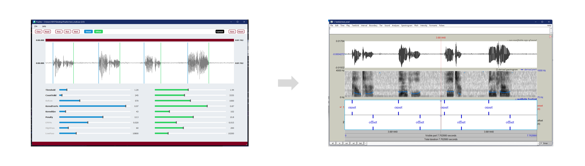
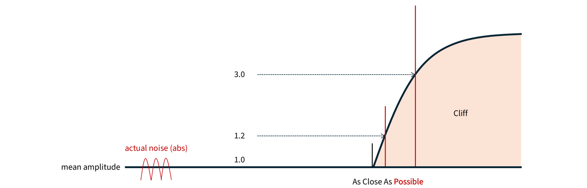

 
 

  

<h3 align="center">Praditor</h3>

基于DBSCAN聚类的自动语音起始点检测器

  

    <a href="https://github.com/Paradeluxe/Praditor/releases"><strong>下载 Praditor</strong></a>
     | 
    <a href="https://github.com/Paradeluxe/Praditor/blob/master/README.md"><strong>English</strong></a>
     · 
    <a href="https://github.com/Paradeluxe/Praditor/blob/master/README_zh.md"><strong>中文</strong></a>

  

 

# 特点
作为**语音起始检测器**， Praditor可以帮助你自动地找到所有的**有声**和**无声**的边界。

Praditor可以处理**单起始点**和**多起始点**音频文件，无论你的音频文件是什么语言。

 - 起始点/结束点检测
 - 有声/无声检测

Praditor计算得出的起始点会以.TextGrid的PointTier呈现，并允许用户调整参数以获得更好的结果。

# 来自作者

如果你想知道如何使用Praditor，或者Praditor的原理，可以联系我的邮箱 `zhengyuan.liu@connect.um.edu.mo` 或 `paradeluxe3726@gmail.com`。

因为Praditor的给出的结果文件是PointTier，如果你需要：

- 导出单个音频文件
- 导出时间戳为表格文件（e.g., .xlsx, .csv)

# 如何使用Praditor?

## 1. 导出音频

`File` -> `Read files...` -> 选择目标音频文件

## 2. 使用Praditor

**对于起始点/终止点...**
- `Run` 应用 Praditor 算法于当前音频
- `Prev`/`Next` 上一个/下一个音频
- `Read` 从当前音频的.TextGrid结果文件里读取时间戳
- `Clear` 清除已显示的时间戳
- `Onset`/`Offset` 显示/隐藏起始点/终止点

**对于参数...**
- `Current/Default` 显示默认/当前参数（即，独属于当前文件的参数）
- `Save` Save the displayed parameters as Current/Default
- `Reset` Reset the displayed parameters to the last time you saved it.

**对于菜单...**
- `File` > `Read files...` > 选择音频文件
- `Help` > `Parameters` > 显示**如何调整参数**的快速指导

**如果你想要放大/缩小视图**

 - <kbd>滚轮 ↑</kbd>/<kbd>滚轮 ↓</kbd> 在**时间线**上放大/缩小
 - <kbd>Ctrl</kbd>+<kbd>滚轮 ↑</kbd>/<kbd>滚轮 ↓</kbd> 在**波幅**上放大/缩小 (针对 Windows 用户)
 - <kbd>Command</kbd>+<kbd>滚轮 ↑</kbd>/<kbd>滚轮 ↓</kbd> 在**波幅**上放大/缩小 (针对 Mac 用户)

# How does Praditor work?
The audio signal is first band-pass filtered to remove some high/low frequency noise. 
Then, it is down sampled with max-pooling strategy (i.e., using the max value to represent each piece).

DBSCAN requires two dimensions. How do we transform 1-D audio signal into 2-D array?
For every two consecutive pieces, they are grouped into a _point_. The point has two dimensions, previous and next frame.
On this point array, Praditor applies DBSCAN clustering to these points. 
Noise points are usually gathered around (0, 0) due to their relatively small amplitudes.

At this point, noise areas are found, which means we have roughly pinpoint the probable locations of onsets (i.e., target area).

We do not continue to use the original amplitudes, but first derivatives. First-derivative thresholding is a common technique
in other signal processing areas (e.g., ECG). It keeps the trend but remove the noisy ("spiky") part, which helps to improve the performance.

For every target area, we do the same procedure as below:
1. Set up a noise reference. It's **mean absolute first-derivatives** as baseline.
2. Scan from the very next frame. We use **kernel smoothing** to see if the current frame (or actually kernel/window) is **valid/invalid**.
3. Until we gather enough **valid** frames, the exact frame/time point we stop is the answer we want.

# Parameters
## HighPass/LowPass
Before we apply down sampling and clustering to the audio signal, a band pass filter is first applied to the original signal.
The idea is that we do not need all the frequencies. Too high and too low frequency band can be contaminated. 

What we need is the middle part that has high contrast between silence and sound.

Be reminded that the **_LowPass_** should not surpass the highest valid frequency (half of the sample rate, refer to _Nyquist theorem_).

## EPS%

DBSCAN clustering requires two parameters: **EPS** and **MinPt**. What DBSCAN does is to scan every point, take it as the circle center, 
and draw a circle with a radius **EPS** in length. Within that circle, calculate how many points within and count them valid if hit **MinPt**.

Praditor allows user to adjust **_EPS%_**. Since every audio file can have different amplitude level/silence-sound contrast,
Praditor determines **EPS = Current Audio's Largest Amplitude * _EPS%_**.

## RefLen
After Praditor has confirmed target areas, the original amplitudes is the transformed into absolute first-derivatives. 
For each target area, Praditor would set up a _Reference Area_, whose mean value serves as the baseline for later thresholding.

The length of this reference area is determined by _**RefLen**_. 
When you want to capture silence that has very short length, it is better that you turn down _**RefLen**_ a little bit as well.

## Threshold
It is the most used parameter. The core idea of thresholding method is about "Hitting the cliff".
Whenever a talker speaks, the (absolute) amplitude rises up and creates a "cliff" (in amplitude, or other features).

**_Threshold_** has a minimum limitation at **1.00**, which is based on the mean value of background-noise reference.
However, background noise is not "smoothy" but actually "spiky". 
That is why **_Threshold_** is usually **slightly larger than 1.00**.

Besides, I would suggest you pay more attention to **aspirated sound**, as this type of sound has "very slow slope". 
Too large **_Threshold_** can end up in the middle of that "slope" (which is something you don't want). 
If that's the case, it can sound really weird, like a burst, rather than gradually smooth in.

## KernelSize, KernelFrm%
After reference area and threshold are set, Praditor will begin scan frame by frame (starting from the frame right next to ref area). 

Usually we would compare the value (abs 1st derivative) with threshold. If it surpasses, we call it _valid_; if not, then _invalid_.
But, Praditor does it a little bit differently, using **kernel smoothing**.
Praditor would borrow information from later frames, like setting up a window (kernel) with a length, **_KernelSize_**,

To prevent extreme values, Praditor would neglect the first few largest values in the window (kernel). Or, we only retain 
**_KernelFrm%_** of all frames (e.g., 80% of all).
If there is actually extreme values, then we successfully avoid them; if not, then it would not hurt since they are
among other values at similar level.

## CountValid, Penalty
How do we say an onset is an onset? After that onset, lots of consecutive frames continue to be above threshold.

As Praditor scans frame by frame (window by window, or kernel by kernel), each frame is either going to be **above** or **below** the threshold. 

If the current frame surpass the threshold, then it's counted as **+1**; 
If it fails to surpass, then it's counted as **-1 * _Penalty_**. 

Then, Praditor adds them up frame by frame (i.e., scanning) to get a **sum**. 
Whenever the **sum** hits zero or below zero, the scanning aborts, and we move on to the next starting frame.
On other words, we only want a starting frame whose **scanning sum stays positive**. 

**_Penalty_** here is like a "knob" for tuning noise sensitivity. Higher **_Penalty_** means higher sensitivity to below-threshold frames.

All in all, each scan has a starting frame (i.e., onset candidate). What we do is to check if this "starting frame" is "valid". 
By saying it "valid", we are saying that scanning sum stays positive and hits **_CountValid_** in the end.

Then, we can say, this is the exact **time point (onset/offset)** we want.

# Data and Materials

If you would like to download the datasets that were used in developing Praditor, please refer to [our OSF storage](https://osf.io/9se8r/)
.

