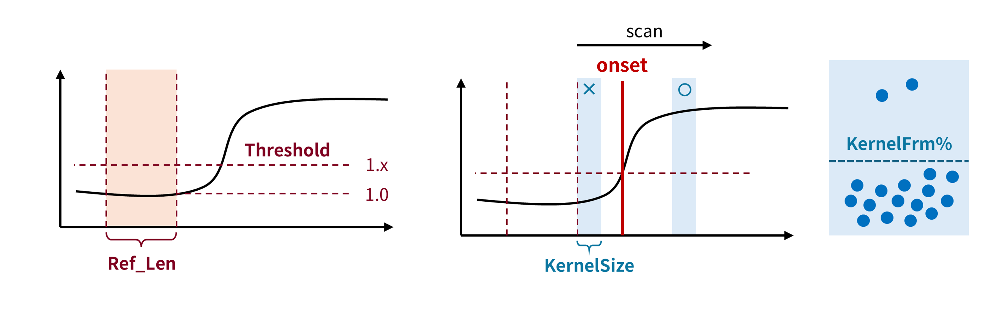

# Before tuning Params (you can skip this)

The audio signal is first band-pass filtered to remove some high/low frequency noise. 
Then, it is down sampled with max-pooling strategy (i.e., using the max value to represent each piece).

DBSCAN requires two dimensions. How do we transform 1-D audio signal into 2-D array?
For every two consecutive pieces, they are grouped into a **point**. The point has two dimensions, previous and next frame.
On this point array, Praditor applies DBSCAN clustering to these points. 
Noise points are usually gathered around (0, 0) due to their relatively small amplitudes.

At this point, noise areas are found, which means we have roughly pinpoint the probable locations of onsets (i.e., target area).

We do not continue to use the original amplitudes but first derivatives. First-derivative thresholding is a common technique
in other signal processing areas (e.g., ECG). It keeps the trend but removes the noisy ("spiky") part, which helps to improve the performance.

For every target area, we do the same procedure as below:
1. Set up a noise reference. It's **mean absolute first-derivatives** as baseline.
2. Set up a **starting frame** as the onset candidate (start from the very next frame from the noise reference).
3. Scan from the starting frame. We use **kernel smoothing** to see if the current frame (or actually kernel/window) is **valid/invalid**.
4. When we gather enough **valid** frames, the exact frame/time point we stop is the answer we want. Otherwise, we move on to the next starting frame.

# Params
Praditor employs **nine parameters** divided into two functional categories: (1) **Denoising** and (2) **Onset** parameters. The latter establishes what it means to be an onset, while the former eliminates noise that might compromise Praditor's algorithmic performance.

## Denoising Parameters
_(LowPass, HighPass, KernelSize, KernelFrm%)_

### Bandpass Filtering (First Stage)
All recordings contain inherent noise to some extent. Our focus lies specifically on noise that impacts Praditor's performance.
You should prioritize frequency bands exhibiting higher energy/amplitude contrast near onsets.
Removing low-contrast frequency bands is supposed to enhance annotation accuracy and precision.

  

#### Related Parameter(s)
* **_LowPass_** (int, Hz): High cutoff frequency
* **_HighPass_** (int, Hz): Low cutoff frequency

### Kernel Smoothing (Second Stage, During Validation)
To identify audio onsets, we only need to see the overall trend of the signal rather than its quick,
sharp fluctuations (the high-frequency components).
The purpose of kernel smoothing in this process is to eliminate these sudden spikes while maintaining the gradual changes that show the signal's true pattern.

  

#### Related Parameter(s)
* **_KernelSize_** (int, frame): Kernel window size in frames (e.g., 100 = 100-frame window)
* **_KernelFrm%_** (float): Percentage of frames retained in a kernel window (e.g., 0.97 = discard top 3% frames by absolute value)

## Onset Parameters
_(Threshold, CountValid, Penalty, RefLen, EPS%)_

### Number of onsets
_Praditor_'s unique multi-onset detection capability derives from DBSCAN clustering pre-thresholding.
This technique identifies potential onset regions through density-based separation: 
(1) Background noise forms dense clusters near the coordinate origin;
(2) Speech signals create sparse clusters away from the origin.

  

The **_EPS%_** parameter optimizes boundary delineation between clusters.
Increased **_EPS%_** incorporates transitional data points (e.g., pauses during utterance), while decreased values exclude them from onset annotations.

#### Related Parameter(s)
* **_EPS%_** (float): Radius ratio calculated from the 80th percentile of absolute amplitudes

### Thresholding
With DBSCAN clustering, we are able to pinpoint all the silence segments.
But it is the boundaries between silence and sound segments that we care about, right? 
Silence segments → Sound segments → Boundaries (Onset/Offset)
So, I apply a set of rules that can pinpoint boundary for each potential onset. 

**(1) Set up a reference segment.** 

The silence segments that we found based on the DBSCAN results are total silence.
It is such great news since we do need a baseline representing silence.
We can do this simply by setting up a time window that is smaller than the silence segment.

The boundaries of silence segments we identified through DBSCAN clustering are most of the time within the range of actual boundaries.

The silence intervals identified through DBSCAN clustering represent complete audio inactivity,
which constitutes a crucial finding for establishing a reliable silence baseline.
To operationalize this discovery, we propose implementing an adaptive time window mechanism where the window duration is
deliberately configured to be shorter than the minimum detected silence interval.

  

#### Related Parameter(s)
* **_RefLen_** (int, frame): Length of the reference segment.

Should be smaller than silence segment, so that you can be sure it stays within the range of silence segment. The average (absolute) value of reference segment is deemed as baseline.

**(2) Determine the threshold.**

Conventional thresholding requires users to input an absolute value as the actual threshold. Whether it is based on absolute amplitude, power, or energy, the annoying thing is you have to determine a new one every time you start working on a new audio file.
In Praditor, we do not have that kind of problem. DBSCAN have clustered and located all the generally low-volume segments (i.e., silence segments), which means you will never need to open another audio processing software to check its absolute value and guess a threshold. What’s more, each potential onset can have its dedicated reference segment, rather than use only one threshold for all the onset annotations.

  

Based on the idea that “Sound should be louder than silence”, we can set a coefficient that is slightly larger than 1.0 (e.g., 1.2) and multiply it with baseline as the actual threshold:

**Actual threshold = Baseline * Coef**

I name this _Coef_ as **_Threshold_**.

#### Related Parameter(s)
* **_Threshold_** (float, >1.0): A coefficient that determines the actual threshold (baseline × _Threshold_ = actual threshold)

**(3) Validate onset candidate**

Following threshold determination, all audio frames are classified into two categories: above-threshold (acoustically active) and below-threshold (silent) frames. The next step is to pinpoint the exact position of onset through the following procedure:

##### 1. Candidate Identification:

Initialize the onset candidate as the first frame right next to the reference segment.

##### 2. Validation Protocol:

Employ a sliding window validation approach based on the fundamental premise that actual onsets should maintain persistent acoustic activity. In plain terms: if you have enough consecutive frames above the threshold, it’s valid.

  * **Above-threshold frames:** +1 contribution
  * **Below-threshold frames:** Penalized with -1 contribution (configurable penalty coefficient)

##### 3. Decision Thresholding:
The net activation score ($S_{net}$) is calculated as:

$$
S_{net}= n_{above} - (n_{below} × Penalty)
$$

where:
* $N_{above}$ = count of above-threshold frames
* $N_{below}$ = count of below-threshold frames
* $Penalty$ = empirically determined tolerance coefficient (Penalty ≥ 1)

Validation occurs when $S_{net} ≥ CountValid$ (minimum activation threshold). 
Candidate rejection occurs if $S_{net} ≤ 0$, prompting evaluation of the next frame as the new candidate.

  

##### 4. Parameter Optimization:

When you aim for a very, very precise onset annotation, you would set a very low threshold,
which could introduce a lot of silence frames into the validation process.
Most of the time, we do not like below-threshold frames. A most common example is the tiny little pause between the sound of saliva when you open your mouth or move your tongue and the sound of actually speaking out.
But it can be necessary in some special cases, like explosive consonants.
Both situations are legitimate, which has brought the need for tuning “tolerance” to the table.
In _Praditor_, we have a “Penalty” parameter for tuning the tolerance of the below-threshold frames. 

The validation function is formalized as:

  

The **_Penalty_** coefficient modulates temporal precision in these ways:
* **High Penalty values** (e.g., >10): Enforce strict temporal boundaries by magnifying silent frame penalties, potentially inducing rightward onset shifts
* **Low Penalty values** (≈1): Permit greater temporal flexibility, accommodating brief articulatory pauses (e.g., plosive consonants, lingual adjustments)

  

#### Related Parameter(s)
* **_CountValid_** (int): Onset qualification standard (valid count = above-threshold frames - [below-threshold frames × penalty])
* **_Penalty_** (float, >1.0): Weight applied to below-threshold frames

