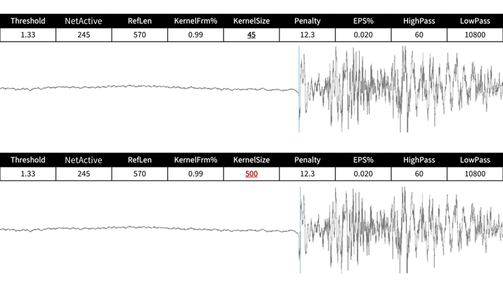
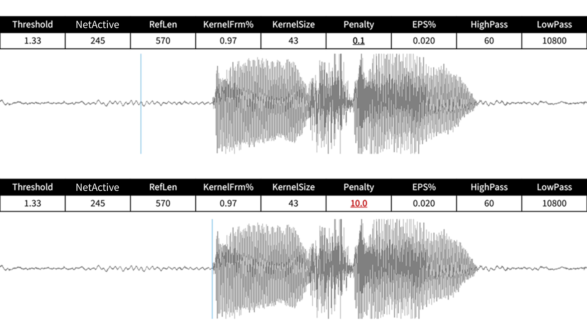
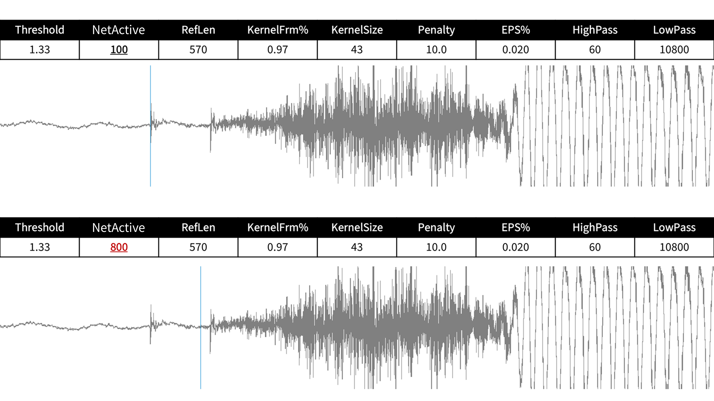

# Fine-tune Praditor
> Refer to [the official GitHub repo](https://github.com/Paradeluxe/Praditor/blob/master/markdown/quick_fix.md) for the latest update.

## Number of onsets
Onsets have generally two types (1) before-speech, and (2) during-speech.

> ↑ means tuning up, ↓ means tuning down

- Too **MANY** onsets: 
  - **during-speech** onsets: [**_EPS%_** ↓](#eps)
- Too **FEW** onsets:
  - Too few **during-speech** onsets: [**_EPS%_** ↑](#eps); if not work, then [**_RefLen_** ↓](#reflen)
  - Part of the **before-speech** onsets are missing: [**_Threshold_** ↓](#threshold)
- Multiple onsets almost overlap, try [**_Threshold_** ↓](#threshold)

## Onset quality
- Too **EARLY** annotation: 
  - Most of the time: [**_Threshold_** ↑](#threshold)
  - If many onsets are stuck before a short **peak**, try [**_NetActive_** ↑](#netactive)
  - If many onsets are stuck before a short **pause**, try [**_Penalty_** ↑](#penalty)
- Too **LATE** annotation:
  - If it is almost at the right place but just **a little too late**, try [**_KernelFrm%_** ↑, **_KernelSize_** ↓](#kernelfrm-kernelsize) (make it sharp)
  - If it is **way too late**, [**_NetActive_** ↓](#netactive)

## Other
- If tuning the above parameters does not change that much, you may want to find more suitable [**_LowPass_** and **_HighPass_**](#lowpass-highpass).

# Detailed Introduction

## LowPass, HighPass
They are the two cutoff frequencies for the bandpass filter. **_LowPass_** should exceed **_HighPass_** and less than the highest valid frequency (i.e., Nyquist frequency).  

$$ \text{LowPass} \leq f_{\text{Nyquist}} = \frac{\text{SampleRate}}{2} $$

If the user ultimately chooses a **_LowPass_** frequency that exceeds Nyquist frequency, _Praditor_ will automatically apply the bandpass filter using the highest valid frequency instead.  

Most of the time, tuning these two parameters will not have that significant impact on the annotation. However, they become particularly useful when recording in an environment with consistent noise interference in a certain frequency band, such as the hum from an air conditioner.  

 
**Figure b1.** An example of tuning **_LowPass_**. **_HighPass_** works the similar way.

## EPS%
It controls the length of radius in DBSCAN clustering. The actual EPS is determined by multiplying the 80% highest value with EPS%. Rather than using a precise number, it is more universally applicable to set up a ratio that can be adjusted for audio files with varying volume levels.  

EPS% is positively correlated with the number of onsets detected. Increasing EPS% identifies more onsets by capturing those within shorter silence intervals, such as between-character pauses in Mandarin speech.  

**Figure b2.** An example of tuning EPS.

## RefLen
**_RefLen_** specifies the number of frames in a reference sequence, designed to cover one period of the dominant background noise frequency.
To avoid the influence of extreme values (e.g., sudden loud noise), the **_KernelFrm%_** parameter is introduced, keeping only a specified percentage of the smallest absolute amplitudes.
The average of these selected amplitudes serves as the baseline for subsequent thresholding.
For example, with **_RefLen_** set to 500 and **_KernelFrm%_** at 0.80, the 100 largest values are excluded, and the average of the remaining 400 values is used as the baseline.  

**Figure b3.** Suggested **_RefLen_** (blue) and extreme values to be avoided (red) in the original signal form.

If **_RefLen_** is too small (e.g., 1), the reference sequence may fail to capture sufficient noise information, compromising its ability to establish a reliable baseline;
Conversely, if **_RefLen_** is too large, it risks including portions of the speech interval, potentially leading to missed onsets.  

**Figure b4.** An example of tuning **_RefLen_**.

## Threshold
The core logic of thresholding resembles "hitting the cliff", where the "cliff" represents the waveform's shape at the onset of an utterance.
For plosive consonants (e.g., [b], [p], [k]), the "cliff" is sharp and distinct, whereas for aspirated consonants (e.g., [f], [θ]),
it resembles a gradual "slope" rather than a "cliff". The actual threshold is calculated by multiplying the baseline by **_Threshold_**.
If the threshold is set too low, annotations may occur prematurely, before the actual onset.
Conversely, if the threshold is set too high, annotations may fall midway on the "slope". It is recommended to set the threshold slightly above the baseline, with the Threshold value slightly exceeding 1.00.  

**Figure b5.** An example of tuning **_Threshold_**. The first annotation is blocked by an abrupt noise spike due to **_Threshold_** being too low.

## KernelFrm%, KernelSize
During the boxcar smoothing, **_KernelSize_** defines the length of the kernel, while **_KernelFrm%_** specifies the percentage of values retained within each kernel.
Tuning these two requires careful consideration, as both excessively high and low values can result in onset annotations being inappropriately early or late.
A high **_KernelSize_** overly smooths the signal, like a larger pixelation brush that blurs a wider area, potentially causing late annotations and reducing accuracy.
Conversely, a small **_KernelSize_** may fail to smooth the signal sufficiently, which could also lead to inaccuracies.
Meanwhile, **_KernelFrm%_** is a double-edged sword. Lowering it decreases sensitivity to abrupt loud noises and speech onsets alike, but its effects are unpredictable, potentially resulting in either early or late annotations.
This randomness necessitates balanced tuning of **_KernelFrm%_** for optimal performance. 

**Figure b6.** An example of tuning **_KernelSize_**.

**Figure b7.** An example of tuning **_KernelFrm%_**.

## Penalty
**_Penalty_** is a parameter used to adjust the sensitivity to noise, particularly below-threshold frames, and is negatively related to the scanning sum.
A higher **_Penalty_** value increases the likelihood to reject a starting frame or onset candidate, even if the silence preceding it is shorter (e.g., subtle noises like lip-smacking before speech).
However, excessive **_Penalty_** values may lead to the omission of valid but subtle onsets (e.g., aspirated consonants), making it critical to fine-tune this parameter based on the characteristics of the dataset.  

**Figure b8.** An example of tuning **_Penalty_**.

## NetActive
**_NetActive_** serves a similar purpose to **_Penalty_** in refining onset detection by demanding a higher level of certainty.
Increasing **_NetActive_** means requiring more above-threshold frames following a candidate onset for it to be considered active.
This adjustment helps ensure that detected onsets are not spurious and correspond to actual transitions from silence to speech.
However, setting **_NetActive_** too high may exclude real onsets, particularly in cases where speech contains softer or shorter segments.  

 
**Figure b9.** An example of tuning **_NetActive_**. The first spike is likely to be lip-smacking.

